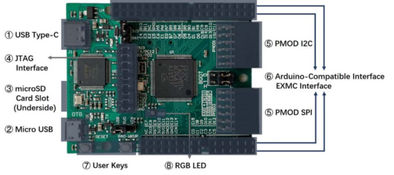
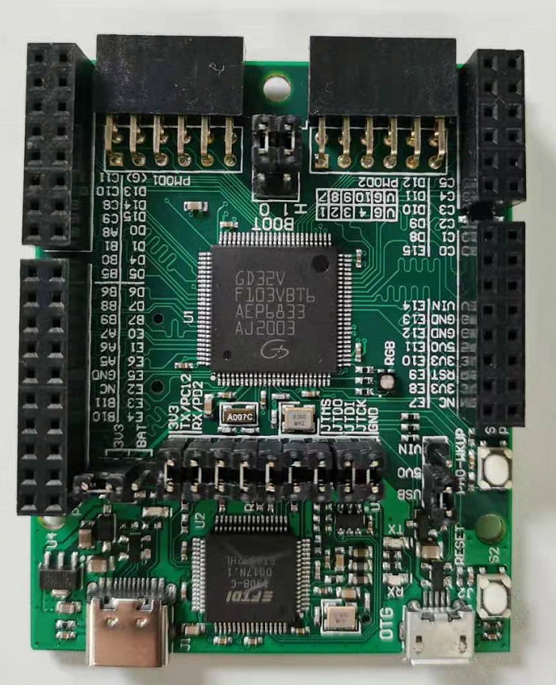
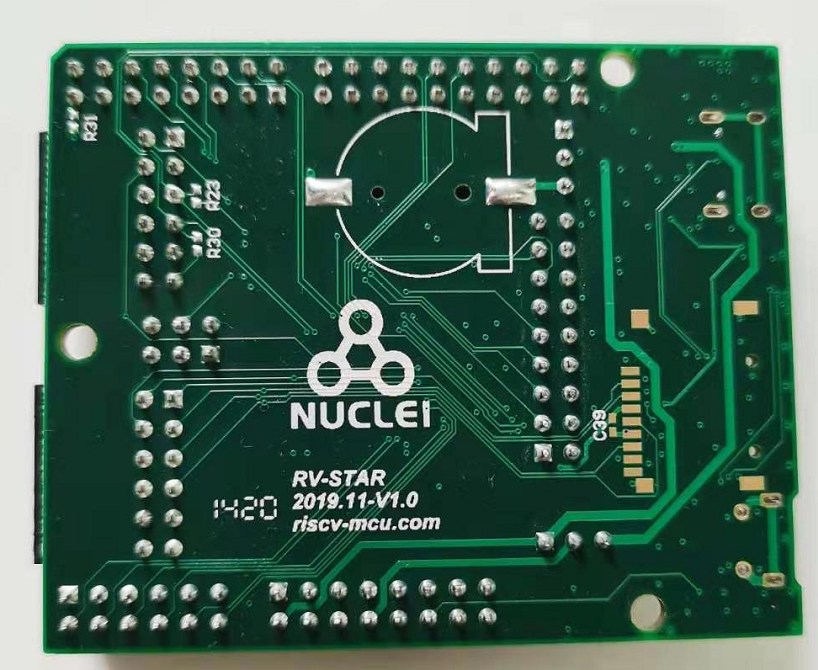

# RV-STAR
基于GD32VF103芯片，针对NUCLEI的RV-STAR开发板的工程。

### 硬件介绍

**RV-STAR开发板及功能简介：**

- 微控制器：GD32VF103VBT6（32位RISC-V处理器）
  - 内核：芯来科技Bumblebee内核（RV32IMAC）
  - 主频：108MHz
  - 内存：内置128KB Flash、32KB SRAM
  - 工作电压：2.6~3.6V
  - 外设资源：Timer（高级16位定时器\*1，通用16位定时器\*4）、U(S)ART\*5、I2C\*2、SPI\*3、CAN\*2、USBFS\*1、ADC\*2（16路外部通道）、DAC\*2、EXMC*1
- 供电方式：5V USB 或者 5~9V 外部直流电源（Arduino Vin）
- 尺寸：66mm*53.4mm
- 外设及接口：
  - USB Type-C接口：下载、调试、串口通信功能
  - Micro USB接口：USB-OTG功能
  - microSD卡插槽（默认没焊接）：外扩SD卡存储（SPI接口）
  - JTAG接口：可分离MCU与调试器，使其各自可单独工作
  - PMOD接口*2：SPI、I2C
  - 双排标准2.54mm排母接口：Arduino兼容接口（外侧），EXMC扩展接口（内侧）
  - 用户按键*2：复位、唤醒
  - RGB LED*1

板子前置图

板子后面外观：

### 工程说明

本工程会逐步开展一些列riscv相关的嵌入式开发教程

* [ ] 基本裸机工程
* [ ] rtos教程
* [ ] 物联网应用
* [ ] 外设教学

本工程主要用于riscv上做一些嵌入式开发的教学工作。

