# 环境安装

[toc]

## 1.本文说明

本工程基于NucleiStudio进行项目构建，需要安装NucleiStudio等工具进行设置。

## 2.工具下载

到芯来科技的官方网站上进行下载

```
https://www.nucleisys.com/download.php
```

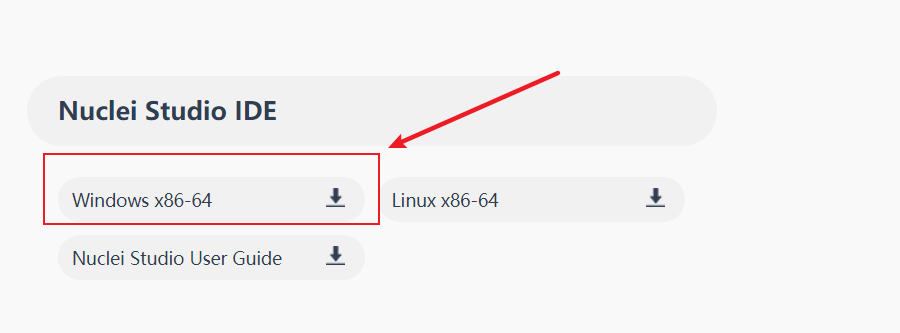

下载完成后，直接解压即可。

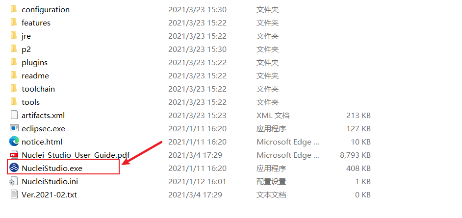

选择NucleiStudio.exe打开工程

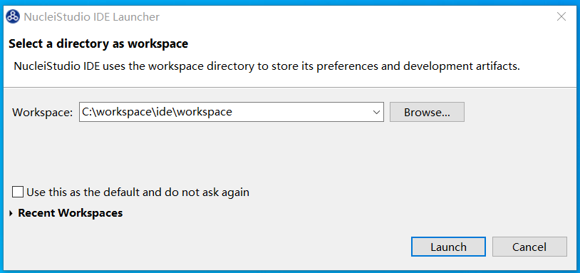

选择workspace即可。

## 3.硬件连接

只需要将TYPEC连接到电脑上

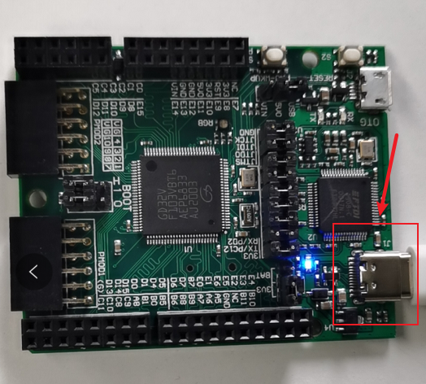

查看设备管理器，有上述图片驱动即可。

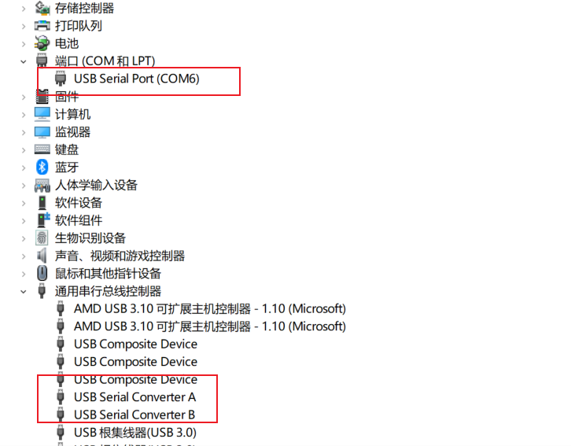

## 4.工程测试

打开NucleiStudio IDE工程，选择Import Project


接着选择需要导入的文件夹即可

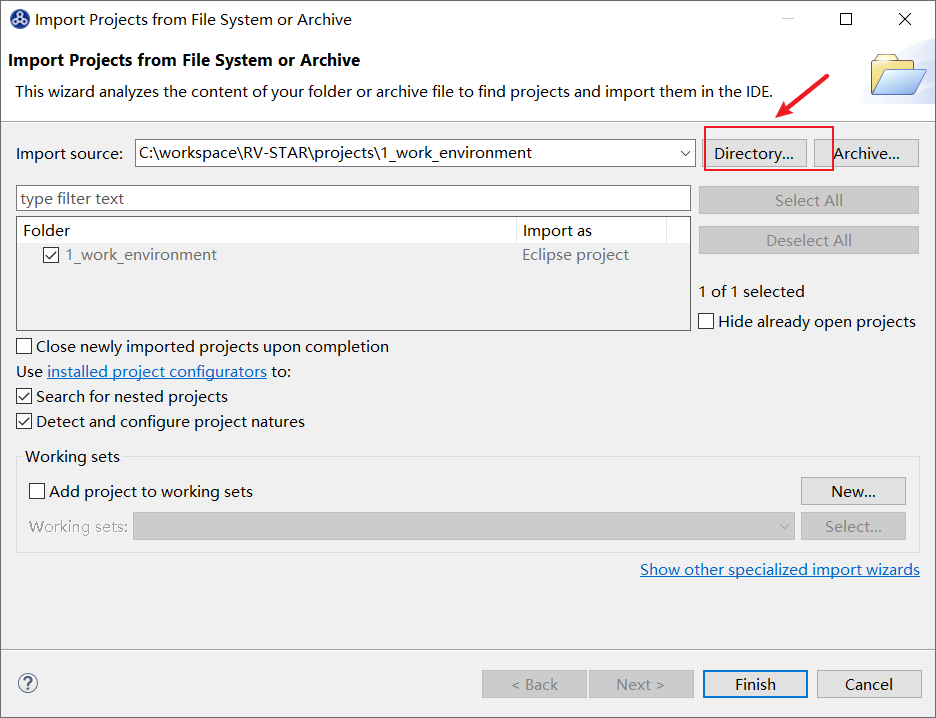

选择工程编译

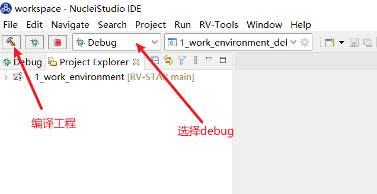

最后确定选择

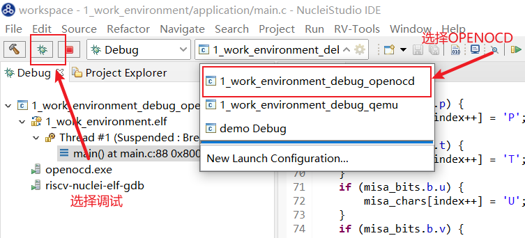

选择openocd后，然后进行调试即可。

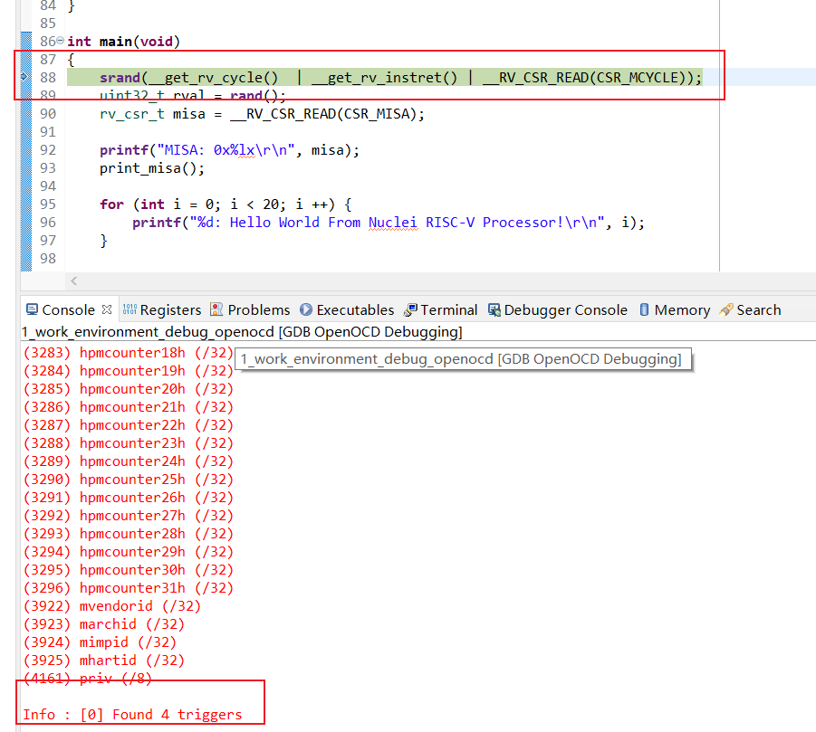

上图表示调试进入正常的模式，此时可以进行单步调试，打开串口终端可看到现象。

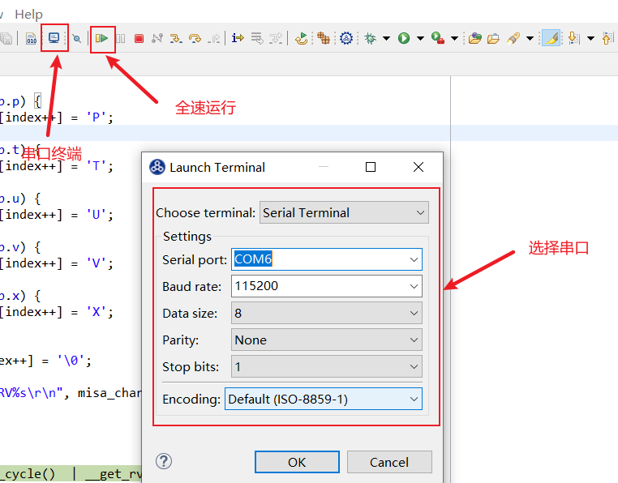

选择串口后，点击全速运行，可以看到串口输出正常信息。

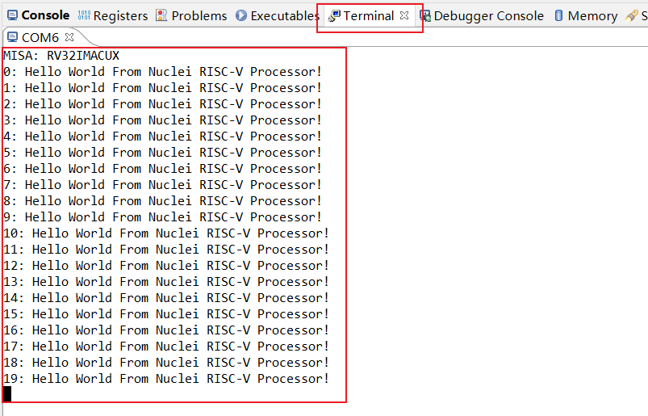

此时表示环境搭建成功。