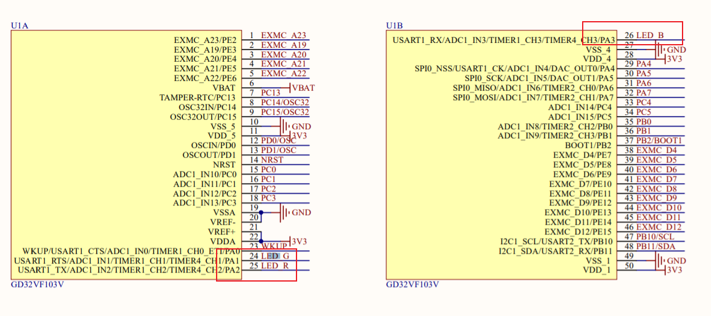

# RGB LED灯实验

[toc]

## 1.实验目的

本实验主要在rv-star的板子上点亮RGB灯。


## 2.环境搭建

实验下载操作可以按照第一节环境搭建来实现

[1_环境安装](./1_环境安装.md)

首先导入工程


然后选择工程


调试选择openocd


最后，直接下载即可。

## 3.实验结果与代码分析

入口在main函数


main函数中调用了`led_config();`函数

该函数的实现如下：

```
void led_config(void)
{
    for(int i=0; i<LEDn; i++)
    {
        gd_rvstar_led_init(i);
        gd_rvstar_led_on(i);
        delay_1ms(1000);
        gd_rvstar_led_off(i);
    }
}
```

首先`LEDn`在gd32vf103_rvstar.h中

```
/* rvstar board low layer led */
#define LEDn                             3U
```

定义了三个LED。

接着调用`gd_rvstar_led_init`初始化gpio。

其实际的实现可以看如下的代码

```
/* Defines for LED functio/* Defines for LED / Key functions to new / general API */
#define gd_rvstar_led_init         gd_led_init
#define gd_rvstar_led_on           gd_led_on
#define gd_rvstar_led_off          gd_led_off
#define gd_rvstar_led_toggle       gd_led_toggle
```

实际上执行的是`gd_led_init`，现在看看该函数的实现

```
/* eval board low layer private functions */
/*!
 *  \brief      configure led GPIO
 *  \param[in]  lednum: specify the led to be configured
 *  \arg        LED1
 *  \param[out] none
 *  \retval     none
 */
void gd_led_init(led_typedef_enum lednum)
{
    /* enable the led clock */
    rcu_periph_clock_enable(`[lednum]);
    /* configure led GPIO port */
    gpio_init(GPIO_PORT[lednum], GPIO_MODE_OUT_PP, GPIO_OSPEED_50MHZ, GPIO_PIN[lednum]);
    GPIO_BOP(GPIO_PORT[lednum]) = GPIO_PIN[lednum];
}
```

首先调用`rcu_periph_clock_enable`初始化对于的GPIO时钟。

对于`GPIO_CLK`有如下的定义。

```
static const rcu_periph_enum GPIO_CLK[LEDn] = {LEDG_GPIO_CLK,LEDB_GPIO_CLK,LEDR_GPIO_CLK};
```

```
#define LEDG_PIN                         GPIO_PIN_1
#define LEDG_GPIO_PORT                   GPIOA
#define LEDG_GPIO_CLK                    RCU_GPIOA

#define LEDB_PIN                         GPIO_PIN_3
#define LEDB_GPIO_PORT                   GPIOA
#define LEDB_GPIO_CLK                    RCU_GPIOA

#define LEDR_PIN                         GPIO_PIN_2
#define LEDR_GPIO_PORT                   GPIOA
#define LEDR_GPIO_CLK                    RCU_GPIOA
```

简单的说，就是LED绿灯对应的是PA1，LED蓝灯对应PA3，LED红灯对应PA2。

查看原理图


对应芯片的引脚



不难看出，操作一个gpio的流程主要是三部分

1.设置GPIO时钟

2.设置初始化设置GPIO

3.操作对应的GPIO位

## 4.调用层次分析

main-->gd32vf103_rvstar-->gd32vf103_xx.c-->寄存器操作

所以如果需要自己实现板子的定义，只需要修改`gd32vf103_rvstar`中间层即可。


