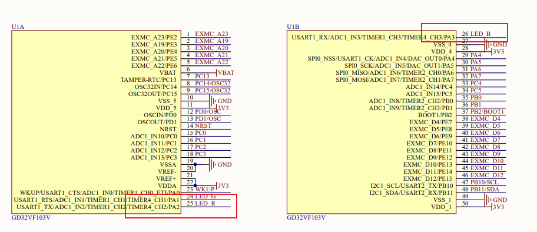

# 3_KEY_POLL按键输入事件

[toc]

## 1.说明

gpio的输入对于一般的开发模式来说，一般可以用来做状态的检测。

开发板上有个PA0（WAKE UP）的按键。


第三个实验的目的就是通过按下按键，切换RGB的LED的亮度来进行实现。

## 2.原理图查看

首先查看KEY的硬件引脚编号


默认情况下为低电平，只有当按下时，才是高电平。


对于的硬件引脚是PA0。

而三个LED对应的引脚分别如下：


只有当引脚输入的是低电平时，对应的LED才会亮起。



这三个的对应关系如下：

```
LED_G-->PA1
LED_B-->PA3
LED_R-->PA2
```

## 3.程序设计

首先函数执行到main函数时，需要初始化GPIO。

```
//gpio init
void user_gpio_init(void)
{
    gd_rvstar_led_init(LED_G);
    gd_rvstar_led_init(LED_B);
    gd_rvstar_led_init(LED_R);

    gd_rvstar_key_init(0, KEY_MODE_GPIO);
}
```

初始化了LED与KEY的引脚。而`gd_rvstar_led_init`实际上就是`gd_led_init`。

```
void gd_led_init(led_typedef_enum lednum)
{
    /* enable the led clock */
    rcu_periph_clock_enable(GPIO_CLK[lednum]);
    /* configure led GPIO port */
    gpio_init(GPIO_PORT[lednum], GPIO_MODE_OUT_PP, GPIO_OSPEED_50MHZ, GPIO_PIN[lednum]);
    GPIO_BOP(GPIO_PORT[lednum]) = GPIO_PIN[lednum];
}
```

接着初始化按键的时候，第一个参数0表示的是当前的gpio编号，而后面的是模式，输入是有两种模式的，这里介绍的是查询模式。所以是GPIO。

实际的main函数做了如下的事情

```
int main(void)
{
    int state = 0;
    user_gpio_init();

    while(1)
    {
        /* check whether the button is pressed */
        if(SET ==  gd_rvstar_key_state_get(0))
        {
            delay_1ms(50);
            /* check whether the button is pressed */
            if(SET == gd_rvstar_key_state_get(0))
            {
                /* toggle the LED */
                state++;
                rgb_toggle(state);
            }
            
            while(SET == gd_rvstar_key_state_get(0))
            {
            }
        }
    }    
}
```

比较关注的是`rgb_toggle`

```
void rgb_toggle(int state)
{
    int cur_state = state % 3;
    if(cur_state == 0)
    {
        LED_G_ON;
        LED_B_OFF;
        LED_R_OFF;
    }

    if(cur_state == 1)
    {
        LED_G_OFF;
        LED_B_ON;
        LED_R_OFF;
    }

    if(cur_state == 2)
    {
        LED_G_OFF;
        LED_B_OFF;
        LED_R_ON;
    }
}
```

这个函数中会根据状态，每次改变状态，从而实现R,G,B灯的循环点亮逻辑。

## 4.实验现象与结果

通过对上述实验的测试，可以看到，每次按下按键的时候，led都会随着状态的改变而发生变化。


