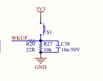

# 4_按键中断实验

[toc]

## 1.前言

按键中断在外部使用时十分的关键，下面主要来分析一下按键终端编写的主要流程。。

在GD32VF103中，有19路中断源。

主要的EXTI的编号事件如下：

| EXIT线编号 | 触发源                   |
| ---------- | ------------------------ |
| 0          | PA0/PB0/PC0/PD0/PE0      |
| 1          | PA1/PB1/PC1/PD1/PE1      |
| 2          | PA2/PB2/PC2/PD2/PE2      |
| 3          | PA3/PB3/PC3/PD3/PE3      |
| 4          | PA4/PB4/PC4/PD4/PE4      |
| 5          | PA5/PB5/PC5/PD5/PE5      |
| 6          | PA6/PB6/PC6/PD6/PE6      |
| 7          | PA7/PB7/PC7/PD7/PE7      |
| 8          | PA8/PB8/PC8/PD8/PE8      |
| 9          | PA9/PB9/PC9/PD9/PE9      |
| 10         | PA10/PB10/PC10/PD10/PE10 |
| 11         | PA11/PB11/PC11/PD11/PE11 |
| 12         | PA12/PB12/PC12/PD12/PE12 |
| 13         | PA13/PB13/PC13/PD13/PE13 |
| 14         | PA14/PB14/PC14/PD14/PE14 |
| 15         | PA15/PB15/PC15/PD15/PE15 |
| 16         | LVD                      |
| 17         | RTC 闹钟                 |
| 18         | USB 唤醒                 |

通过前面的分析



按键对应的GPIO是PA0，并且按下是高电平。

## 2.原理分析

按照EXTI的设置，中断线每四组共享一个中断，简而言之，就是说`PA0,PA1,PA2,PA3`共享一组中断。

对于PA0来说，首先配置中断源选择。


该实现通过

```
void gpio_exti_source_select(uint8_t output_port, uint8_t output_pin)
```

来进行中断的绑定。
接着配置EXTI寄存器。

按照EXTI中断寄存器的解释，有如下特性

| 寄存器名称 | 地址        | 功能                 |
| ---------- | ----------- | -------------------- |
| EXTI_INTEN | 0x4001 0400 | 中断使能寄存器       |
| EXTI_EVEN  | 0x4001 0404 | 事件使能寄存器       |
| EXTI_RTEN  | 0x4001 0408 | 上升沿触发使能寄存器 |
| EXTI_FTEN  | 0x4001 040C | 下降沿触发使能寄存器 |
| EXTI_SWIEV | 0x4001 0410 | 软件中断事件寄存器   |
| EXTI_PD    | 0x4001 0414 | 挂起寄存器           |

可以通过

```
void exti_init(exti_line_enum linex, exti_mode_enum mode, exti_trig_type_enum trig_type)
```

中断线对应每个位，第二个是设置中断还是事件，第三个是设置中断类型。

第二个参数

```
EXTI_INTERRUPT
EXTI_EVENT
```

第三个参数

```
EXTI_TRIG_RISING
EXTI_TRIG_FALLING
EXTI_TRIG_BOTH
EXTI_TRIG_NONE
```

最后的实现

```
exti_init(EXTI_0, EXTI_INTERRUPT, EXTI_TRIG_FALLING);
```

接着清除中断屏蔽

```
exti_interrupt_flag_clear(EXTI_0);
```


